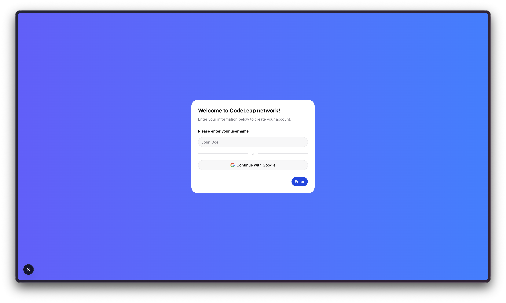
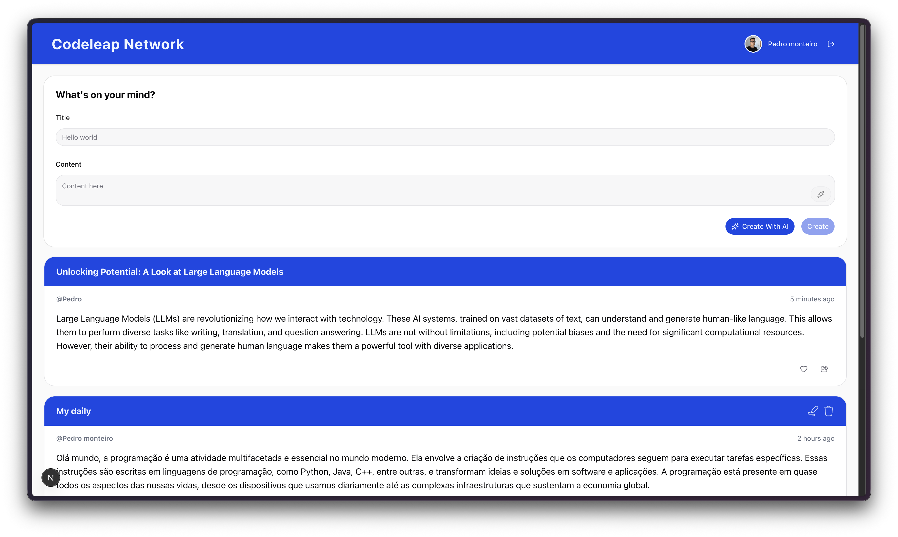
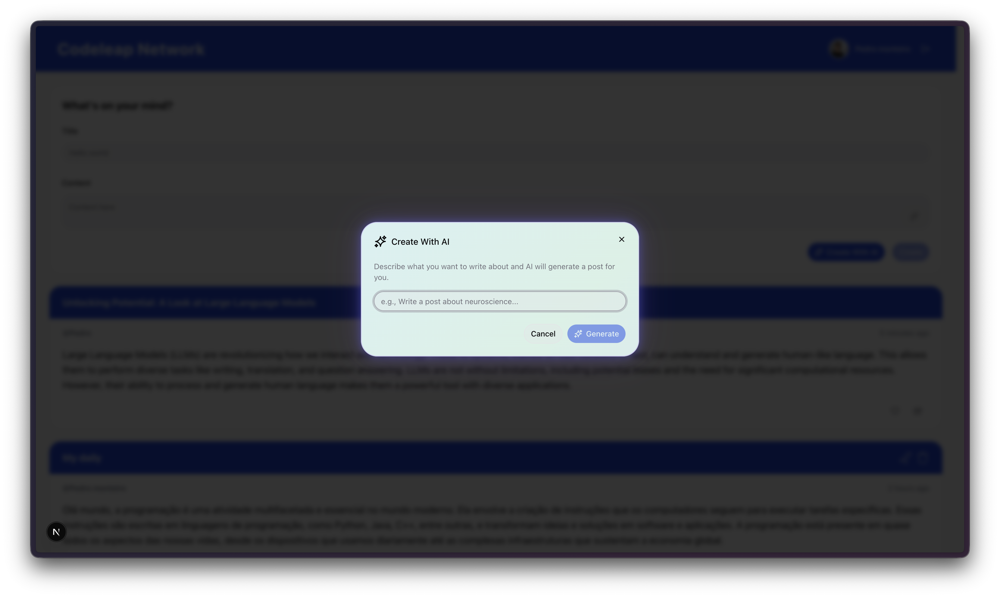
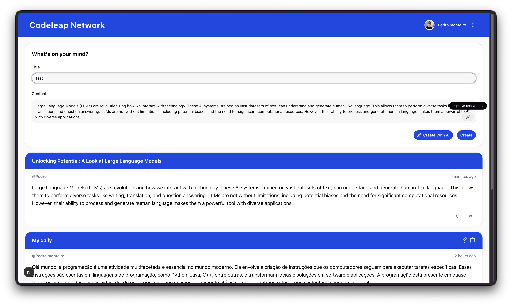
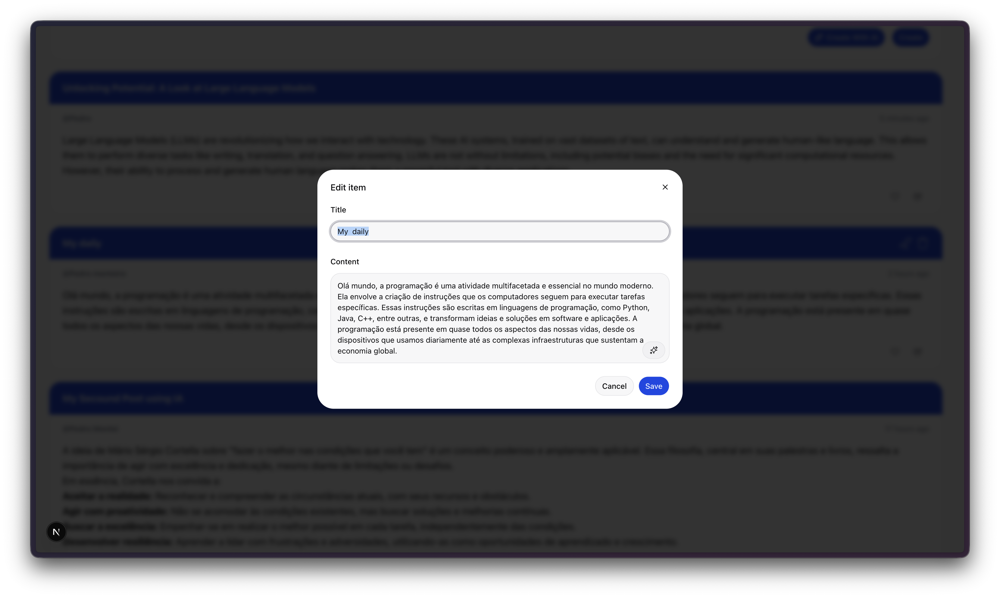
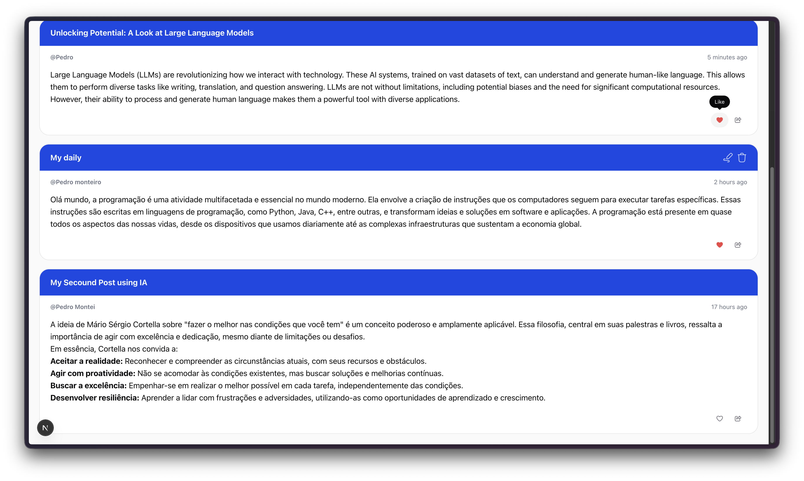

# CodeLeap Network 

## About

**CodeLeap Network** is a modern social platform where developers can create, share, and interact with posts. Built as a technical challenge for **CodeLeap**, it features a complete CRUD system, **Firebase authentication** with Google Sign-In, **AI-powered post generation** using Google Gemini, and a polished UI with smooth animations powered by Motion (Framer Motion).

## Tech Stack


| Category | Technologies |
|----------|-------------|
| **Framework** | Next.js 16, React 19, TypeScript 5 |
| **Styling** | Tailwind CSS 4, shadcn/ui, Radix UI |
| **Authentication** | Firebase Auth, Google OAuth |
| **State Management** | TanStack React Query, React Hook Form |
| **AI Integration** | Vercel AI SDK, Google Gemini 2.0 Flash |
| **Animations** | Motion (Framer Motion) |
| **Validation** | Zod |
| **Notifications** | Sonner |
| **HTTP Client** | Axios |
| **Markdown** | React Markdown, remark-gfm |

## Table of Contents

- [About](#about)
- [Tech Stack](#tech-stack)
- [Features](#features)
- [Challenges](#challenges)
- [Screenshots](#screenshots)
- [Architecture](#architecture)
- [Installation](#installation)
- [Environment Variables](#environment-variables)
- [Contact](#contact)

## Features

**Authentication**
- Sign up with username (validated with Zod, 5-12 characters)
- Google Sign-In via Firebase Authentication
- Protected routes with AuthGuard provider
- Session persistence through localStorage

**Post Management (CRUD)**
- Create posts with title and rich content (Markdown support)
- Edit your own posts through a modal dialog
- Delete posts with confirmation alert
- Real-time feed with all community posts
- Relative timestamps ("2 minutes ago", "3 hours ago")

**AI-Powered Features**
- Generate entire posts from a prompt using Google Gemini 2.0 Flash
- Improve existing text with AI streaming (real-time text replacement)
- Beautiful aurora-themed AI dialog with animated neon border

**UI & Interactions**
- Animated like button with spring physics
- Smooth page transitions and staggered card animations
- Skeleton loaders for loading states
- Toast notifications for success/error feedback
- Full GitHub Flavored Markdown rendering in posts
- Accessible components with ARIA attributes and keyboard support

## Challenges

During development, I faced some interesting challenges:

- **Optimistic Updates with TanStack Query** — Implementing optimistic post creation (instant UI feedback before server confirmation) while handling rollback on failure required careful cache management.
- **AI Streaming Integration** — Building real-time text improvement that streams AI-generated content chunk by chunk into the textarea using the TextDecoder API.
- **Feature-Based Architecture** — Structuring the project with isolated feature modules (auth, post, shared), each with their own components, hooks, types, and API layers.
- **Form State Synchronization** — Coordinating React Hook Form with AI-generated content, edit dialogs, and validation across multiple forms simultaneously.
- **Firebase + Google OAuth** — Integrating Firebase Authentication with Google Sign-In provider and managing user session state across the application.

These challenges helped me deepen my understanding of modern React patterns, server state management, and AI integration in web applications.

## Screenshots








## Architecture

The project follows a **feature-based folder structure** for scalability and maintainability:

```
src/
├── app/                        # Next.js App Router
│   ├── page.tsx                # Sign-up page (public)
│   ├── (private)/home/         # Protected feed page
│   └── api/                    # AI API routes (Gemini)
├── features/                   # Feature modules
│   ├── auth/sign-up/           # Auth components, hooks, types
│   ├── post/                   # Post CRUD, AI hooks, queries
│   └── shared/                 # Providers, header, guards
├── components/ui/              # shadcn/ui component library
├── hooks/                      # Shared custom hooks
├── lib/                        # Firebase, Axios, QueryClient
└── constants/                  # Query keys factory
```

**Key Patterns:**
- Custom hooks for all business logic extraction
- TanStack Query for server state with optimistic updates
- Zod schemas as single source of truth for types and validation
- Centralized API layer with Axios instance
- Provider pattern for auth guard and query client

## Installation

1. **Clone the repository:**
   ```bash
   git clone https://github.com/your-username/codeleap-challenge.git
   cd codeleap-challenge
   ```

2. **Install dependencies:**
   ```bash
   npm install
   ```

3. **Set up environment variables:**
   ```bash
   cp .env.example .env.local
   ```
   Fill in the required variables (see [Environment Variables](#environment-variables)).

4. **Run the development server:**
   ```bash
   npm run dev
   ```

5. **Open in browser:**
   ```
   http://localhost:3000
   ```

## Environment Variables

Create a `.env.local` file in the root directory with the following variables:

```env
# API
NEXT_PUBLIC_API_URL=https://dev.codeleap.co.uk/

# AI (Vercel AI Gateway)
AI_GATEWAY_API_KEY=your_ai_gateway_key

# Firebase
NEXT_PUBLIC_FIREBASE_API_KEY=your_firebase_api_key
NEXT_PUBLIC_FIREBASE_AUTH_DOMAIN=your_project.firebaseapp.com
NEXT_PUBLIC_FIREBASE_PROJECT_ID=your_project_id
NEXT_PUBLIC_FIREBASE_STORAGE_BUCKET=your_project.firebasestorage.app
NEXT_PUBLIC_FIREBASE_MESSAGING_SENDER_ID=your_sender_id
NEXT_PUBLIC_FIREBASE_APP_ID=your_app_id
```

## Contact

Feel free to reach out if you want to exchange ideas or give feedback about this project:

[](https://www.linkedin.com/in/pedro-oliveira-m/)
[](mailto:pedro.oliveira@monteirodev.com)

---

Built with dedication for the CodeLeap Engineering Challenge.
